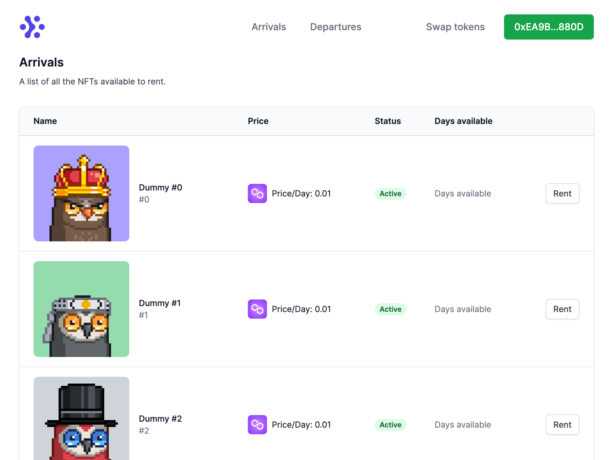

  

<h1 align="center">
  Conveyr: Cross-Chain NFT Renting
</h1>

  ⚔️ ⛓️ 🤑

  <strong>
    Cross. Chain. NFT Renting.
  </strong>

  Creating a seamless cross chain NFT renting experience.   The future is multi-chain, but where is your wallet?

  
  
  
  
  

[**👉 Our Glorious Deployment URL 👈**](https://conveyr.xyz/)

## Table of Contents

- [Concept](#concept)
- [Product](#product)
- [Technical Implementation](#technical-implementation)
- [UX inspiration](#ux-inspiration)
- [Business Potential](#business-potential)
- [License](#license)
- [Thanks](#thanks)

### Concept

- There are many blockchains out there, each with great assets and communities
- The future is definitely multi-chain!
- However, the User eXperience of interacting with multiple chains is cumbersome
  - Multiple wallets need to be created and navigated by the user
  - Tokens need to be swapped around, also by the user
  - It is so easy to make a mistake, lose out on an opportunity, or simply get discouraged

### Product

- Cross-chain NFT renting experience
- With simple and straightforward UX, without wallet juggling
- No matter what chain and which wallet or tokens you have
- You can list and rent NFTs on multiple chains, without the multi chain hassle
- At the end of the reantal period, the NFT can be:  
    - automatically returned (future)
    - forfeited and collateral returned to the lender (future)

### UX inspiration
- We didn't want to use the typical grid-based listings
- Our UX concept is that of Arrivals and Departures boards at airports
- We think this might provide novel engagement for users
  - Instantly knowing what NFTs are new and incoming    
  - Instantly knowing which rented NFTs will be returned soon
  - Driving engagement

### Technical Implementation

- We have created NFT renting contracts for lenders and renters
- We have deployed the contracts on Polygon and Avalanche
- Mixed in some Axelar magic to make the contracts **cross-chain BFF!**
  - Axelar GMP enables communication among NFTMarket contracts across chains
  - Axelar also enables seamless transfer of the NFT from lender to renter accross chains
  - [Mumbai Polygonscan](https://mumbai.polygonscan.com/address/0x8c787c95e9f1bbc6153336571b7ab58cd57ad98c)
  - [Moonbase Alpha](https://moonbase.moonscan.io/token/0xec19ebb094269b2782fbab3b5ce6e3cb4dea86a2)
  - [Axelar dashboard](https://axelar.network/)
- Sprinkled SwingXYX to automate token conversion for payments and collateral between MATIC and AVAX
- Designed UI where Lenders and Renters do not need to worry about blockchain details
  - [Our Glorious Deployment URL](https://conveyr.xyz/)

### Business Potential
 - Renter pays a rent fee to the Lender, via our NFTMarket smart contract
 - Prior transfering the fee to the lender, the contract earmarks a portion of the fee
    - for gas and swap fees (TBD)
    - for protocol profit (TBD)

## 🧐 License

Licensed under the [MIT License](./LICENSE).

## 💜 Thanks

Thanks go out to all of the many sponsors and [ETHToronto](https://www.ethtoronto.ca/).
