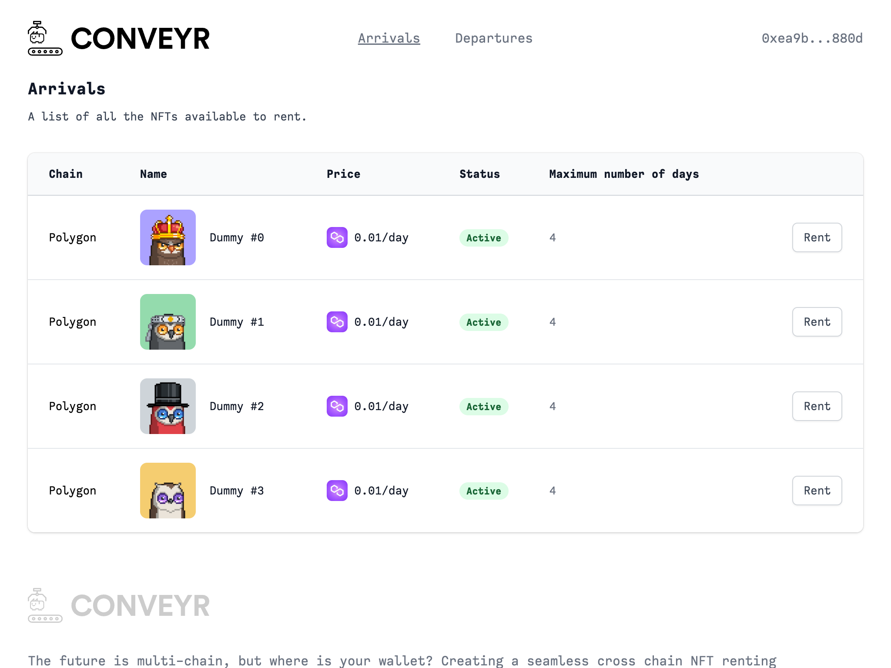
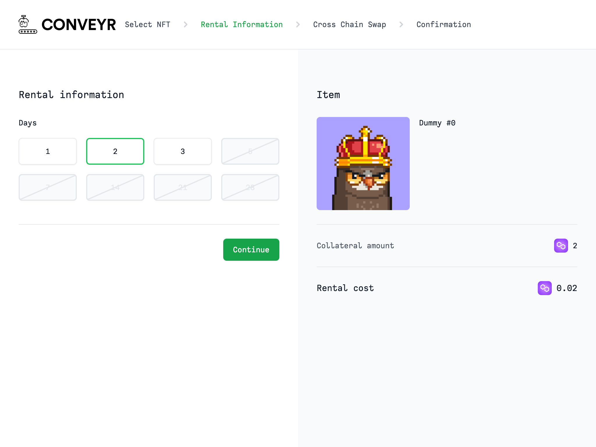
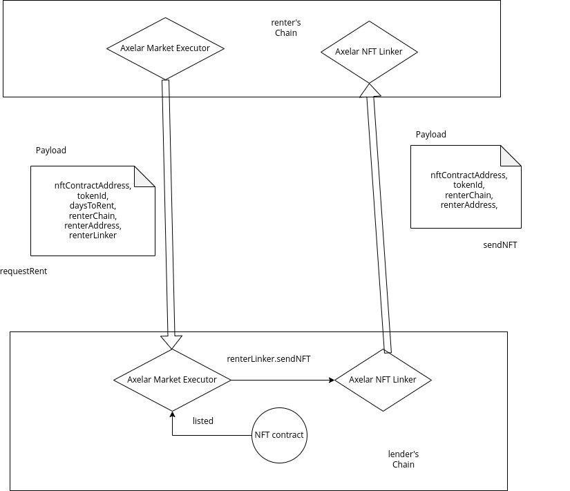

  

<h1 align="center">
  Conveyr
</h1>

  ⚔️ ⛓️ 🤑

  <strong>
    Cross. Chain. NFT Renting.
  </strong>

  Creating a seamless cross chain NFT renting experience. The future is multi-chain, but where is your wallet?

  
  
  
  
  

[**👉 Our Glorious Deployment URL 👈**](https://conveyr.xyz/)

## Table of Contents

- [Concept](#concept)
- [Product](#product)
- [Technical Implementation](#technical-implementation)
- [UX Inspiration](#ux-inspiration)
- [Business Potential](#business-potential)
- [License](#license)
- [Thanks](#thanks)

## Concept

- There are many blockchains out there, each with great assets and communities
- The future is definitely multi-chain!
- However, the User eXperience of interacting with multiple chains is cumbersome:
  - Multiple wallets need to be created and navigated by the user
  - Tokens need to be swapped around, also by the user
  - It is so easy to make a mistake, lose out on an opportunity, or simply get discouraged

## Product

- Cross chain NFT renting experience
- With simple and straightforward UX, without wallet juggling
- No matter what chain and which wallet or tokens you have
- You can list and rent NFTs on multiple chains without the multi-chain hassle
- At the end of the rental period, the NFT can be:
  - Automatically returned (future)
  - Forfeited and collateral returned to the Lender (future)

## UX Inspiration

- We didn’t want to use the typical grid-based listings
- Our UX concept is that of Arrivals and Departures boards at airports
- We think this might provide novel engagement for users:
  - Instantly knowing what NFTs are new and incoming
  - Instantly knowing which rented NFTs will be returned soon
  - Driving engagement

## Technical Implementation

- We will have one existing NFT deployed on some chain, say Polygon 
- We will have exactly one NFTLinker contract and one NFTMarket contract deployed on each chain
- The NFT Market will take change to the nft listing together with payment verification and nft transfer trigger
- The NFT Linker will take care of the actual cross chain NFT transfer

The flow can be summarized as follows:
1. The renter will interact with the NFT Market contract on his chain, after sending the payment to the NFT Market,
  deployed on the lender's Chain via swing.xyz (allowing efficient cross chain token swap)
2. The NFT market function requestRent contract will trigger an Axelar cross chain call to the NFT Marketplace on
the lender's chain, where the actual listing infos are stored
3. After verifying that the renting conditions are satisfied and the payment is effectively deposited, the 
contract itself will redirect the payment to the lender and it will trigger the NFT cross chain transfer 
passing the execution to the NFT Linker contract
4. The Linker contract will finalize the execution back to the renter's chain, finalizing the process

This process will allow the renter to rent the NFT without switching the network and explicitly swapping token

## Business Potential

- The Renter pays a rental fee to the Lender, via our NFTMarket smart contract.
- The platform will charge an extra percentage to the renter on top of the rental cost
- The platform can eventually make profits by providing API data about nft statistics, once the volume of the NFT listed is high enough

## 🧐 License

Licensed under the [MIT License](./LICENSE).

## 💜 Thanks

Thanks go out to all of the many sponsors and [ETHToronto](https://www.ethtoronto.ca/),
in particular to Vivek from swing.xyz and the devs at Axelar
