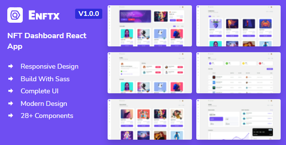

# The future is multi chain, but where is your wallet?

## Creating seamless cross chain NFT Renting experience
<br><br>

<p>

  <a href="https://amplication.com" target="_blank">
    
  </a>
</p>




[Our Glorious Deployment URL](https://here.xyz)

---

Contents
===

 * [Why](#why)
 * [What we built](#What-we-built)
 * [How we built it](#How-we-built)


 ### Why

+ There are many blockchains out there, each with great assets and communities
+ The future is definitely multi chain   
+ However, the User eXperience interacting with multiple chains is cumbersome
    + Mutiple wallets need to be created and constantly switched, by the user
    + Tokens need to be swapped around, by the user
    + It is so easy to make a mistake, loose on the opportunity, or simply get discouraged
    + Or worse, fall a victim to a hack

 ### What we built
 + Cross chain NFT renting experience
 + With simple and straightforward UX
 + No matter what chain and which wallet or tokens you have 
 + You can list and rent NFTs on multiple chains, without the multi chain hassle

 
 ### How we built it
 + We have created NFT renting contracts for lenders and renters
 + We have deployed the contracts on Polygon and Moonbeam
    - [Mumbai Polygonscan](https://mumbai.polygonscan.com/address/0x8c787c95e9f1bbc6153336571b7ab58cd57ad98c) 
    - [Moonbase Alpha](https://moonbase.moonscan.io/token/0xec19ebb094269b2782fbab3b5ce6e3cb4dea86a2)
    
 + Mixed in some Axelar magic to make the contracts **cross chain BFF!**
    - [Axelar dashboard](https://axelar.network/)
    
 + Sprinkled SwingXYX to automate token conversion for payments and collateral between ETH and GLMR
 + Designed UI where Lenders and Renters do not need to worry about blockchain details
    - [Our Glorious Deployment URL](https://here.xyz)

#### Details
 ```json
    "@alch/alchemy-web3": "^1.2.3",
    "@openzeppelin/contracts": "^4.7.0",
    "@openzeppelin/contracts-ethereum-package": "^3.0.0",
    "@openzeppelin/upgrades": "^2.8.0",
    "bignumber": "^1.1.0",
    "hardhat-abi-exporter": "^2.10.0"
```


## License

[MIT](https://choosealicense.com/licenses/mit/)

